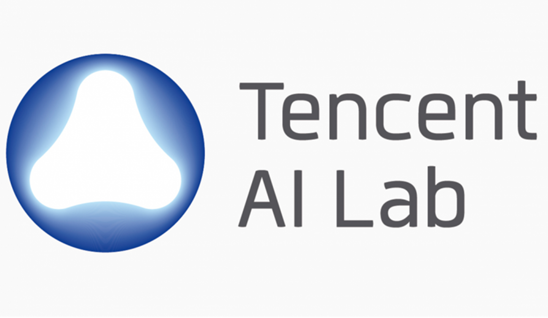
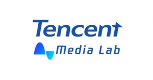

## Industrial

<table width="900" cellpadding="20">
<tr>
<td width="100px", align="center">
    
</td>
<!-- <td width="44">&nbsp;</td> -->
<td width = "800", align="left">
    <ul>
        <li>
            <b> Tencent America </b> - Tencent AI Lab (Bellevue, WA, USA)
        </li>
        <li>
            Research Intern (May 2022 - Aug 2022)
        </li>
        <li>
            Multi-Channel Audio-visual Speaker Diarization
        </li>
    </ul>
</td>
</tr>
</table>

<table width="900" cellpadding="20">
<tr>
<td width="100px", align="center">
    
</td>
<!-- <td width="44">&nbsp;</td> -->
<td width = "800", align="left">
    <ul>
        <li>
            <b> Bytedance / Tiktok </b> - Speech, Audio & Music Intelligence (Mountain View, CA, USA)
        </li>
        <li>
            Research Intern (May 2021 - Aug 2021)
        </li>
        <li>
            Audio-visual Active Speaker Detection
        </li>
    </ul>
</td>
</tr>
</table>

<table width="900" cellpadding="20">
<tr>
<td width="100px", align="center">
    
</td>
<!-- <td width="44">&nbsp;</td> -->
<td width = "800", align="left">
    <ul>
        <li>
            <b> Tencent </b> - Tencent Media Lab (Shenzhen, Guangdong, China)
        </li>
        <li>
            Research Intern (Jun 2019 - Aug 2019)
        </li>
        <li>
            Perceptual Loss Design for Mask-based Speech Enhancement
        </li>
    </ul>
</td>
</tr>
</table>

<table width="900" cellpadding="20">
<tr>
<td width="100px", align="center">
    
</td>
<!-- <td width="44">&nbsp;</td> -->
<td width = "800", align="left">
    <ul>
        <li>
            <b> Momenta </b> - Level4 Urban Autonomous Driving (Suzhou, Jiangsu, China)
        </li>
        <li>
            R&D Intern (Mar 2019 - Jun 2019)
        </li>
        <li>
            vehicle behavioral prediction with urban vehicle trajectory data
        </li>
    </ul>
</td>
</tr>
</table>

## Teaching

### Teaching Assistant

`Fall 2022` ECE 440 Introduction to Random Processes 

`Spring 2022` ECE 208/408  The Art of Machine Learning (Also gave a [guest lecture](https://youtu.be/trRkNKNM5aE))

`Spring 2021` ECE 272/472 Audio Signal Processing 

`Fall 2020` ECE 477 Computer Audition (Also gave a [guest lecture](./contents/GuestLec_Neil_ECE477_Fall2021.pdf))

`Spring 2020` ECE 272/472 Audio Signal Processing 

`Fall 2019` ECE 216 Microprocessor & Data Conversion 

### Students Mentored

**Yongyi Zang**, AME Undergrad@UR

**Siwen Ding**, DS master@Columbia

**Abudukelimu Wuerkaixi**, PhD student@Tsinghua

**Xinhui Cheng**, CS Master@UR, Next Move: PhD student@Lehigh

## Services

### Reviewers
* Audio Engineering Society (AES) 152nd, 153rd Convention

* IEEE Transactions on Computational Imaging (TCI)

* International Journal of Electrical and Computer Engineering Systems (IJECES)

* Imaging Science Journal

### Co-chaired

* [Western New York Virtual and Augmented Reality Mini-Conference 2022](https://www.rochester.edu/augmented-virtual-reality/news-events/conference.html)

