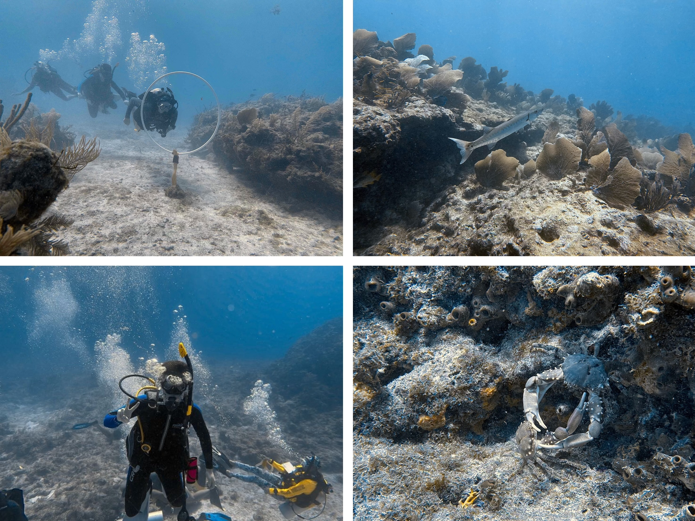

## About my name
My first name, "You (优)", means *Excellent* in Mandarin Chinese. 
Its pronunciation may cause misunderstanding in English when people refer to me, especially in a group discussion.
Hence, I choose to go by "Neil", and this name originates from an Irish word meaning *Champion*. I think this nickname aligns with the idea of my given name.  

## Besides research
I earned my SSI Open Water certification in Key Largo in the summer of 2025.  

During my summer 2023 internship at Seattle, I learned and enjoyed stand-up paddling quite much.

My favorite movies are [*Real Steel*](https://www.imdb.com/title/tt0433035/) and [*Begin Again*](https://www.imdb.com/title/tt1980929/).

I also love traveling all around the world, especially to places with friends living.

